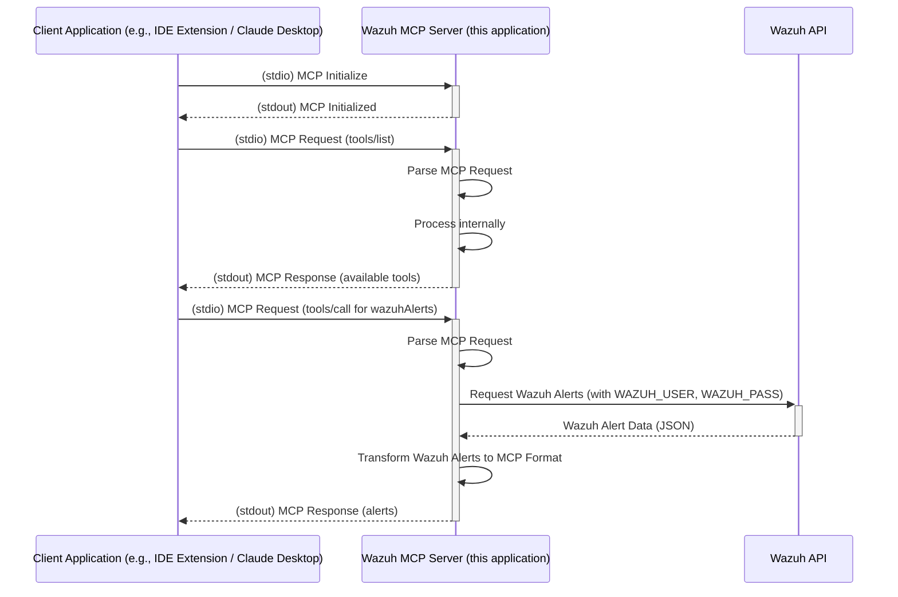

# mcp_server_wazuh_2025
We have to built a MCP Server for Wazuh SIEM. 

**Build:**
  ```bash
    git clone https://github.com/Gitmy3/mcp_server_wazuh_2025.git
  ```
**Activate the Virtual Environment:**
  ```bash
    /venv/Scripts/activate
  ```
OR 
  ```bash
   .\/.venv/Scripts/activate
  ```
**To Start the MCP Server:**
  ```bash
    uvicorn app.main:app --reload
  ```
**To Update the pip:**
 ```bash
    python -m pip install --upgrade pip
 ```
**To check if the MCP Server is connected with the OpenAI or not(check with Thunderclient):**
 ```arduino
    http://127.0.0.1:8000/query_llm/
 ```

# MCP Server - Connecting with Wazuh SIEM

A Rust-based server to be designed to bridge the gap between a Wazuh Security Information and Event Management (SIEM) system and applications requiring contextual security data, specifically tailored for the Claude Desktop Integration using the Model Context Protocol (MCP).

## Overview

Modern AI assistants like Claude can benefit significantly from real-time context about the user's security environment. The Wazuh MCP Server bridges this gap by providing comprehensive access to Wazuh SIEM data through natural language interactions.

This server transforms complex Wazuh API responses into MCP-compatible format, enabling AI assistants to access:

- **Security Alerts & Events** from the Wazuh Indexer for threat detection and incident response
- **Agent Management & Monitoring** including health status, system processes, and network ports
- **Vulnerability Assessment** data for risk management and patch prioritization  
- **Security Rules & Configuration** for detection optimization and compliance validation
- **System Statistics & Performance** metrics for operational monitoring and audit trails
- **Log Analysis & Forensics** capabilities for incident investigation and compliance reporting
- **Cluster Health & Management** for infrastructure reliability and availability requirements
- **Compliance Monitoring & Gap Analysis** for regulatory frameworks like PCI-DSS, HIPAA, SOX, and GDPR

Rather than requiring manual API calls or complex queries, security teams can now ask natural language questions like "Show me critical vulnerabilities on web servers," "What processes are running on agent 001?" or "Are we meeting PCI-DSS logging requirements?" and receive structured, actionable data from their Wazuh deployment.

This approach is particularly valuable for compliance teams who need to quickly assess security posture, identify gaps in monitoring coverage, validate rule effectiveness, and generate evidence for audit requirements across distributed infrastructure.


## Example Use Cases

The Wazuh MCP Server provides direct access to Wazuh security data through natural language interactions, enabling several practical use cases:

### Security Alert Analysis
*   **Alert Triage and Investigation:** Query recent security alerts with `get_wazuh_alert_summary` to quickly identify and prioritize threats requiring immediate attention.
*   **Alert Pattern Recognition:** Analyze alert trends and patterns to identify recurring security issues or potential attack campaigns.

### Vulnerability Management
*   **Agent Vulnerability Assessment:** Use `get_wazuh_vulnerability_summary` and `get_wazuh_critical_vulnerabilities` to assess security posture of specific agents and prioritize patching efforts.
*   **Risk-Based Vulnerability Prioritization:** Correlate vulnerability data with agent criticality and exposure to focus remediation efforts.

### System Monitoring and Forensics
*   **Process Analysis:** Investigate running processes on agents using `get_wazuh_agent_processes` for threat hunting and system analysis.
*   **Network Security Assessment:** Monitor open ports and network services with `get_wazuh_agent_ports` to identify potential attack vectors.
*   **Agent Health Monitoring:** Track agent status and connectivity using `get_wazuh_running_agents` to ensure comprehensive security coverage.

### Security Operations Intelligence
*   **Rule Effectiveness Analysis:** Review and analyze security detection rules with `get_wazuh_rules_summary` to optimize detection capabilities.
*   **Manager Performance Monitoring:** Track system performance and statistics using tools like `get_wazuh_weekly_stats`, `get_wazuh_remoted_stats`, and `get_wazuh_log_collector_stats`.
*   **Cluster Health Management:** Monitor Wazuh cluster status with `get_wazuh_cluster_health` and `get_wazuh_cluster_nodes` for operational reliability.

### Incident Response and Forensics
*   **Log Analysis:** Search and analyze manager logs using `search_wazuh_manager_logs` and `get_wazuh_manager_error_logs` for incident investigation.
*   **Agent-Specific Investigation:** Combine multiple tools to build comprehensive profiles of specific agents during security incidents.
*   **Natural Language Security Queries:** Ask complex security questions in natural language and receive structured data from multiple Wazuh components.

### Operational Efficiency
*   **Automated Reporting:** Generate security reports and summaries through conversational interfaces without manual API calls.
*   **Cross-Component Analysis:** Correlate data from both Wazuh Indexer (alerts) and Wazuh Manager (agents, rules, vulnerabilities) for comprehensive security insights.
*   **Multilingual Security Operations:** Access Wazuh data and receive insights in multiple languages for global security teams.

### Threat Intelligence Gathering and Response

For enhanced threat intelligence capabilities, the Wazuh MCP Server can be combined with the **[Cortex MCP Server](https://github.com/gbrigandi/mcp-server-cortex/)** to create a powerful security analysis ecosystem.

**Enhanced Capabilities with Cortex Integration:**
*   **Artifact Analysis:** Automatically analyze suspicious files, URLs, domains, and IP addresses found in Wazuh alerts using Cortex's 140+ analyzers
*   **IOC Enrichment:** Enrich indicators of compromise (IOCs) from Wazuh alerts with threat intelligence from multiple sources including VirusTotal, Shodan, MISP, and more
*   **Automated Threat Hunting:** Combine Wazuh's detection capabilities with Cortex's analysis engines to automatically investigate and classify threats
*   **Multi-Source Intelligence:** Leverage analyzers for reputation checks, malware analysis, domain analysis, and behavioral analysis
*   **Response Orchestration:** Use analysis results to inform automated response actions and alert prioritization

**Example Workflow:**
1. Wazuh detects a suspicious file hash or network connection in an alert
2. The AI assistant automatically queries the Cortex MCP Server to analyze the artifact using multiple analyzers
3. Results from VirusTotal, hybrid analysis, domain reputation, and other sources are correlated
4. The combined intelligence provides context for incident response decisions
5. Findings can be used to update Wazuh rules or trigger additional monitoring

## Requirements

-   An MCP (Model Context Protocol) compatible LLM client (e.g., Claude Desktop)
-   A running Wazuh server (v4.12 recommended) with the API enabled and accessible.
-   Network connectivity between this server and the Wazuh API (if API interaction is used).

## Installation

### Option 1: Download Pre-built Binary (Recommended)

1.  **Download the Binary:**
    *   Go to the [Releases page](https://github.com/gbrigandi/mcp-server-wazuh/releases) of the `mcp-server-wazuh` GitHub repository.
    *   Download the appropriate binary for your operating system (e.g., `mcp-server-wazuh-linux-amd64`, `mcp-server-wazuh-macos-amd64`, `mcp-server-wazuh-windows-amd64.exe`).
    *   Make the downloaded binary executable (e.g., `chmod +x mcp-server-wazuh-linux-amd64`).
    *   (Optional) Rename it to something simpler like `mcp-server-wazuh` and move it to a directory in your system's `PATH` for easier access.

### Option 2: Docker 

1.  **Pull the Docker Image:**
    ```bash
    docker pull ghcr.io/gbrigandi/mcp-server-wazuh:latest
    ```

### Option 3: Build from Source

1.  **Prerequisites:**
    *   Install Rust: [https://www.rust-lang.org/tools/install](https://www.rust-lang.org/tools/install)

2.  **Build:**
    ```bash
    git clone https://github.com/gbrigandi/mcp-server-wazuh.git
    cd mcp-server-wazuh
    cargo build --release
    ```
    The binary will be available at `target/release/mcp-server-wazuh`.

### Configure Your LLM Client

The method for configuring your LLM client will vary depending on the client itself. For clients that support MCP (Model Context Protocol), you will typically need to point the client to the path of the `mcp-server-wazuh` executable.

**Example for Claude Desktop:**

Configure your `claude_desktop_config.json` file:

```json
{
  "mcpServers": {
    "wazuh": {
      "command": "/path/to/mcp-server-wazuh",
      "args": [],
      "env": {
        "WAZUH_API_HOST": "your_wazuh_manager_api_host",
        "WAZUH_API_PORT": "55000",
        "WAZUH_API_USERNAME": "your_wazuh_api_user",
        "WAZUH_API_PASSWORD": "your_wazuh_api_password",
        "WAZUH_INDEXER_HOST": "your_wazuh_indexer_host",
        "WAZUH_INDEXER_PORT": "9200",
        "WAZUH_INDEXER_USERNAME": "your_wazuh_indexer_user",
        "WAZUH_INDEXER_PASSWORD": "your_wazuh_indexer_password",
        "WAZUH_VERIFY_SSL": "false",
        "WAZUH_TEST_PROTOCOL": "https",
        "RUST_LOG": "info"
      }
    }
  }
}
```

Replace `/path/to/mcp-server-wazuh` with the actual path to your binary and configure the environment variables as detailed in the [Configuration](#configuration) section.

Once configured, your LLM client should be able to launch and communicate with the `mcp-server-wazuh` to access Wazuh security data.

If using Docker, create a `.env` file with your Wazuh configuration:
    
```bash
WAZUH_API_HOST=your_wazuh_manager_api_host
WAZUH_API_PORT=55000
WAZUH_API_USERNAME=your_wazuh_api_user
WAZUH_API_PASSWORD=your_wazuh_api_password
WAZUH_INDEXER_HOST=your_wazuh_indexer_host
WAZUH_INDEXER_PORT=9200
WAZUH_INDEXER_USERNAME=your_wazuh_indexer_user
WAZUH_INDEXER_PASSWORD=your_wazuh_indexer_password
WAZUH_VERIFY_SSL=false
WAZUH_TEST_PROTOCOL=https
RUST_LOG=info
```

Configure your `claude_desktop_config.json` file:

```
{
  "mcpServers": {
    "wazuh": {
      "command": "docker",
      "args": [
        "run", "--rm", "-i",
        "--env-file", "/path/to/your/.env",
        "ghcr.io/gbrigandi/mcp-server-wazuh:latest"
      ]
    }
  }
}
```

## Configuration

Configuration is managed through environment variables. A `.env` file can be placed in the project root for local development.

| Variable                 | Description                                                                    | Default     | Required |
| ------------------------ | ------------------------------------------------------------------------------ | ----------- | -------- |
| `WAZUH_API_HOST`         | Hostname or IP address of the Wazuh Manager API server.                        | `localhost` | Yes      |
| `WAZUH_API_PORT`         | Port number for the Wazuh Manager API.                                         | `55000`     | Yes      |
| `WAZUH_API_USERNAME`     | Username for Wazuh Manager API authentication.                                 | `wazuh`     | Yes      |
| `WAZUH_API_PASSWORD`     | Password for Wazuh Manager API authentication.                                 | `wazuh`     | Yes      |
| `WAZUH_INDEXER_HOST`     | Hostname or IP address of the Wazuh Indexer API server.                        | `localhost` | Yes      |
| `WAZUH_INDEXER_PORT`     | Port number for the Wazuh Indexer API.                                         | `9200`      | Yes      |
| `WAZUH_INDEXER_USERNAME` | Username for Wazuh Indexer API authentication.                                 | `admin`     | Yes      |
| `WAZUH_INDEXER_PASSWORD` | Password for Wazuh Indexer API authentication.                                 | `admin`     | Yes      |
| `WAZUH_VERIFY_SSL`       | Set to `true` to verify SSL certificates for Wazuh API and Indexer connections.  | `false`     | No       |
| `WAZUH_TEST_PROTOCOL`    | Protocol for Wazuh connections (e.g., "http", "https"). Overrides client default. | `https`     | No       |
| `RUST_LOG`               | Log level (e.g., `info`, `debug`, `trace`).                                    | `info`      | No       |

**Note on `WAZUH_VERIFY_SSL`:** For production environments, it is strongly recommended to set `WAZUH_VERIFY_SSL=true` and ensure proper certificate validation for both Wazuh Manager API and Wazuh Indexer connections. Setting it to `false` disables certificate checks, which is insecure.
The "Required: Yes" indicates that these variables are essential for the server to connect to the respective Wazuh components. While defaults are provided, they are unlikely to match a production or non-local setup.

## Building

### Prerequisites

-   Install Rust: [https://www.rust-lang.org/tools/install](https://www.rust-lang.org/tools/install)
-   Install Docker and Docker Compose (optional, for containerized deployment): [https://docs.docker.com/get-docker/](https://docs.docker.com/get-docker/)

### Local Development

1.  **Clone the repository:**
    ```bash
    git clone https://github.com/gbrigandi/mcp-server-wazuh.git 
    cd mcp-server-wazuh
    ```
2.  **Configure (if using Wazuh API):**
    -   Copy the example environment file: `cp .env.example .env`
    -   Edit the `.env` file with your specific Wazuh API details (e.g. `WAZUH_API_HOST`, `WAZUH_API_PORT`).
3.  **Build:**
    ```bash
    cargo build
    ```
4.  **Run:**
    ```bash
    cargo run
    # Or use the run script (which might set up stdio mode):
    # ./run.sh
    ```

## Architecture

The server is built using the [rmcp](https://crates.io/crates/rmcp) framework and facilitates communication between MCP clients (e.g., Claude Desktop, IDE extensions) and the Wazuh MCP Server via stdio transport. The server interacts with the Wazuh Indexer and Wazuh Manager APIs to fetch security alerts and other data.



**Data Flow (stdio focus):**

1.  An application (e.g., an IDE extension, a CLI tool) launches the Wazuh MCP Server as a child process.
2.  The application sends MCP-formatted requests (commands) to the server's `stdin`.
3.  The Wazuh MCP Server reads the command from `stdin`.
4.  **Processing:**
    *   The server parses the MCP command.
    *   If the command requires fetching data from Wazuh (e.g., "get latest alerts"):
        *   The server connects to the Wazuh API (authenticating if necessary using configured credentials like `WAZUH_USER`, `WAZUH_PASS`).
        *   It fetches the required data (e.g., security alerts).
        *   The server's transformation logic (`src/mcp/transform.rs`) processes each alert, mapping Wazuh fields to MCP fields.
    *   If the command is internal (e.g., a status check specific to the MCP server), it processes it directly.
5.  The server sends an MCP-formatted JSON response (e.g., transformed alerts, command acknowledgment, or error messages) to the application via its `stdout`.
6.  The application reads and processes the MCP response from the server's `stdout`.

This stdio interaction allows for tight integration with local development tools or other applications that can manage child processes. An optional HTTP endpoint (`/mcp`) may also be available for clients that prefer polling.


The server communicates via `stdin` and `stdout` using JSON-RPC 2.0 messages, adhering to the Model Context Protocol (MCP).

Example interaction flow:

1.  **Client Application (e.g., IDE extension) starts the `mcp-server-wazuh` process.**

2.  **Client sends `initialize` request to server's `stdin`:**
    ```json
    {
      "jsonrpc": "2.0",
      "id": 0,
      "method": "initialize",
      "params": {
        "protocolVersion": "2024-11-05",
        "capabilities": {
          "sampling": {},
          "roots": { "listChanged": true }
        },
        "clientInfo": {
          "name": "mcp-inspector",
          "version": "0.11.0"
        }
      }
    }
    ```

3.  **Server sends `initialize` response to client via `stdout`:**
    ```json
    {
      "jsonrpc": "2.0",
      "id": 1,
      "result": {
        "protocolVersion": "2024-11-05",
        "capabilities": {
          "prompts": {},
          "resources": {},
          "tools": {}
        },
        "serverInfo": {
          "name": "rmcp",
          "version": "0.1.5"
        },
        "instructions": "This server provides tools to interact with a Wazuh SIEM instance for security monitoring and analysis.\nAvailable tools:\n- 'get_wazuh_alert_summary': Retrieves a summary of Wazuh security alerts. Optionally takes 'limit' parameter to control the number of alerts returned (defaults to 100)."
      }
    }
    ```

4.  **Client sends `notifications/initialized` to server's `stdin`:**
    (This is a notification, so `id` is omitted by the client.)
    ```json
    {
      "jsonrpc": "2.0",
      "method": "notifications/initialized"
    }
    ```

5.  **Client requests available tools by sending `tools/list` to server's `stdin`:**
    ```json
    {
      "jsonrpc": "2.0",
      "id": 1,
      "method": "tools/list",
      "params": {}
    }
    ```

6.  **Server responds with the list of tools to client via `stdout`:**
    ```json
    {
      "jsonrpc": "2.0",
      "id": 2,
      "result": {
        "tools": [
          {
            "name": "get_wazuh_alert_summary",
            "description": "Retrieves a summary of Wazuh security alerts. Returns formatted alert information including ID, timestamp, and description.",
            "inputSchema": {
              "$schema": "http://json-schema.org/draft-07/schema#",
              "properties": {
                "limit": {
                  "description": "Maximum number of alerts to retrieve (default: 100)",
                  "format": "uint32",
                  "minimum": 0.0,
                  "type": ["integer", "null"]
                }
              },
              "title": "GetAlertSummaryParams",
              "type": "object"
            }
          }
        ]
      }
    }
    ```

7.  **Client calls the `get_wazuh_alert_summary` tool by sending `tools/call` to server's `stdin`:**
    ```json
    {
      "jsonrpc": "2.0",
      "id": 3,
      "method": "tools/call",
      "params": {
        "name": "get_wazuh_alert_summary",
        "arguments": {
          "limit": 5
        }
      }
    }
    ```

8.  **Server receives on `stdin`, processes the `get_wazuh_alert_summary` call (which involves querying the Wazuh Indexer API and transforming the data).**

9.  **Server sends `tools/call` response with formatted alerts to client via `stdout`:**
    ```json
    {
      "jsonrpc": "2.0",
      "id": 3,
      "result": {
        "content": [
          {
            "type": "text",
            "text": "Alert ID: 1747091815.1212763\nTime: 2024-01-15T10:30:45.123Z\nAgent: web-server-01\nLevel: 7\nDescription: Attached USB Storage"
          },
          {
            "type": "text", 
            "text": "Alert ID: 1747066333.1207112\nTime: 2024-01-15T10:25:12.456Z\nAgent: database-server\nLevel: 5\nDescription: New dpkg (Debian Package) installed."
          }
        ],
        "isError": false
      }
    }
    ```

    **Or, if no alerts are found:**
    ```json
    {
      "jsonrpc": "2.0",
      "id": 3,
      "result": {
        "content": [
          {
            "type": "text",
            "text": "No Wazuh alerts found."
          }
        ],
        "isError": false
      }
    }
    ```

    **Or, if there's an error connecting to Wazuh:**
    ```json
    {
      "jsonrpc": "2.0",
      "id": 3,
      "result": {
        "content": [
          {
            "type": "text",
            "text": "Error retrieving alerts from Wazuh: HTTP request error: connection refused"
          }
        ],
        "isError": true
      }
    }
    ```

## Development & Testing

-   **Code Style:** Uses standard Rust formatting (`cargo fmt`).
-   **Linting:** Uses Clippy (`cargo clippy`).
-   **Testing:** Contains unit tests for transformation logic and integration tests. For stdio, tests might involve piping input/output to a test harness. For HTTP, tests use a mock Wazuh API server (`httpmock`) and a test MCP client.
    ```bash
    # Run all tests
    cargo test

    # Run specific integration test (example for HTTP tests)
    # cargo test --test integration_test

    # Run tests with detailed logging
    RUST_LOG=debug cargo test
    ```
-   See `tests/README.md` for more details on running tests and using the test client CLI.

## License

This project is licensed under the [MIT License](LICENSE).
